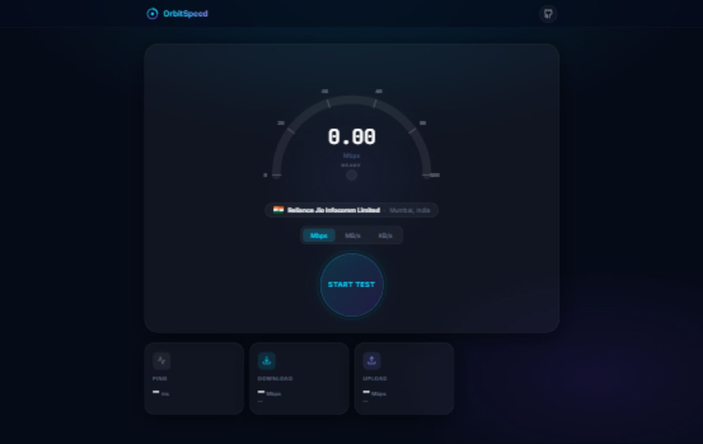
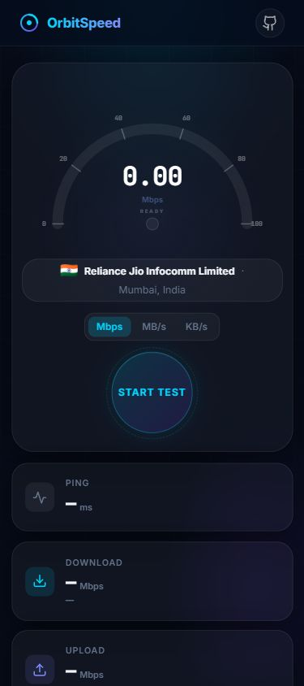

# OrbitSpeed

> A polished Flask internet speed test dashboard for measuring ping, download speed, upload speed, ISP details, connection grade, streaming readiness, and historical test results.

<p align="center">
  <a href="https://internet-speed-test-sage.vercel.app/">Live Demo</a>
  &nbsp;|&nbsp;
  <a href="https://github.com/iragavarapunagaatchutaneelima/Internet-Speed-Test">GitHub Repository</a>
  &nbsp;|&nbsp;
  <a href="https://github.com/iragavarapunagaatchutaneelima/Internet-Speed-Test/issues">Report Issue</a>
</p>

<p align="center">
  
  
  
  
  
</p>

## Preview

### Desktop



### Mobile



## About

OrbitSpeed is a full-stack internet speed test built with Python Flask, Jinja2 templates, static CSS, vanilla JavaScript, and SQLite. It is designed to be simple to run locally, clean to deploy, and visually strong enough for a professional GitHub portfolio.

The app currently deployed on Vercel is the same Flask version served locally at `http://localhost:5000`.

## Highlights

| Capability | What it does |
|---|---|
| Ping test | Measures round-trip latency through the Flask backend |
| Download test | Streams random bytes from Python to estimate download throughput |
| Upload test | Sends a generated payload to Flask and measures upload throughput |
| ISP lookup | Fetches public IP, ISP, city, and country through a server-side helper |
| Quality score | Calculates a connection grade from ping, download, and upload results |
| Streaming support | Estimates support for video calls, streaming, and cloud gaming |
| History | Stores recent test results in SQLite |
| Responsive interface | Supports desktop and mobile layouts with the same visual system |
| Vercel deployment | Runs through a Python serverless entry point |

## Live Links

| Resource | URL |
|---|---|
| Live demo | https://internet-speed-test-sage.vercel.app/ |
| GitHub repository | https://github.com/iragavarapunagaatchutaneelima/Internet-Speed-Test |

## Project Modernization

This repository was refreshed so GitHub and Vercel now represent the latest local Flask project, not the earlier React/Vite version.

Completed updates:

- Removed the old tracked Vite/React frontend files from the repository.
- Removed the old generated Vercel project and redeployed a fresh Flask version.
- Added a Vercel Python entry point at `api/index.py`.
- Updated `vercel.json` to route all requests through the Flask app.
- Replaced Node-focused CI with Python validation.
- Updated the Dockerfile to run the Flask server.
- Removed cached Python bytecode and the local SQLite database from source control.
- Rewrote the README and added screenshots from the current local UI.
- Added an MIT license under Neelima's name.

## Architecture

```text
Browser
  |
  | HTML, CSS, JavaScript
  v
Flask app
  |
  | API routes
  v
Python speed test utilities
  |
  | Save and read results
  v
SQLite history database
```

## Repository Structure

```text
Internet-Speed-Test/
├── api/
│   └── index.py              # Vercel serverless entry point
├── docs/
│   └── screenshots/          # README screenshots
├── static/
│   ├── css/
│   │   └── style.css         # Main visual design
│   └── js/
│       ├── gauge.js          # Speedometer rendering logic
│       ├── main.js           # UI orchestration
│       └── speedtest.js      # Browser-side test workflow
├── templates/
│   └── index.html            # Main Flask-rendered page
├── app.py                    # Flask routes and API endpoints
├── database.py               # SQLite persistence helpers
├── speed_utils.py            # Quality, streaming, and IP helpers
├── requirements.txt          # Python dependencies
├── vercel.json               # Vercel routing configuration
├── Dockerfile                # Container runtime
├── LICENSE                   # MIT license
└── README.md                 # Project documentation
```

## Requirements

| Tool | Recommended version | Required for |
|---|---:|---|
| Python | 3.10 or newer, 3.12 recommended | Running the Flask app |
| pip | Latest available | Installing dependencies |
| Git | Latest available | Cloning and source control |
| Docker | Optional | Container deployment |
| Vercel CLI | Optional | Vercel deployment |

## Quick Start

```bash
git clone https://github.com/iragavarapunagaatchutaneelima/Internet-Speed-Test.git
cd Internet-Speed-Test
pip install -r requirements.txt
python app.py
```

Open:

```text
http://localhost:5000
```

## Installation On Windows

1. Install Python from https://www.python.org/downloads/windows/.
2. During installation, enable "Add python.exe to PATH".
3. Open PowerShell.
4. Clone and run the project:

```powershell
git clone https://github.com/iragavarapunagaatchutaneelima/Internet-Speed-Test.git
cd Internet-Speed-Test
python -m venv .venv
.\.venv\Scripts\Activate.ps1
pip install -r requirements.txt
python app.py
```

If PowerShell blocks virtual environment activation, run:

```powershell
Set-ExecutionPolicy -Scope CurrentUser RemoteSigned
```

Then activate the environment again.

## Installation On macOS

1. Install Python using Homebrew or python.org.
2. Open Terminal.
3. Clone and run the project:

```bash
git clone https://github.com/iragavarapunagaatchutaneelima/Internet-Speed-Test.git
cd Internet-Speed-Test
python3 -m venv .venv
source .venv/bin/activate
pip install -r requirements.txt
python app.py
```

If `python` points to Python 2 on your machine, use `python3` consistently.

## Installation On Linux

### Ubuntu or Debian

```bash
sudo apt update
sudo apt install -y python3 python3-pip python3-venv git
git clone https://github.com/iragavarapunagaatchutaneelima/Internet-Speed-Test.git
cd Internet-Speed-Test
python3 -m venv .venv
source .venv/bin/activate
pip install -r requirements.txt
python app.py
```

### Fedora

```bash
sudo dnf install -y python3 python3-pip git
git clone https://github.com/iragavarapunagaatchutaneelima/Internet-Speed-Test.git
cd Internet-Speed-Test
python3 -m venv .venv
source .venv/bin/activate
pip install -r requirements.txt
python app.py
```

### Arch Linux

```bash
sudo pacman -Syu python python-pip git
git clone https://github.com/iragavarapunagaatchutaneelima/Internet-Speed-Test.git
cd Internet-Speed-Test
python -m venv .venv
source .venv/bin/activate
pip install -r requirements.txt
python app.py
```

## Configuration

| Variable | Default | Description |
|---|---|---|
| `PORT` | `5000` | Local Flask server port |
| `FLASK_ENV` | `development` | Enables debug mode when set to `development` |
| `VERCEL` | Set by Vercel | Makes SQLite use Vercel's writable temp directory |

Run on a custom port:

```bash
PORT=8000 python app.py
```

On Windows PowerShell:

```powershell
$env:PORT = "8000"
python app.py
```

## API Reference

| Method | Endpoint | Description |
|---|---|---|
| `GET` | `/` | Renders the OrbitSpeed dashboard |
| `GET` | `/api/test/ping` | Returns a lightweight ping response |
| `GET` | `/api/test/download?bytes=N` | Streams random bytes for download testing |
| `POST` | `/api/test/upload` | Receives upload test bytes and returns confirmation |
| `GET` | `/api/info` | Returns public IP, ISP, city, and country |
| `GET` | `/api/quality?download=&upload=&ping=` | Returns a weighted quality score |
| `GET` | `/api/streaming?download=` | Returns streaming platform support tiers |
| `GET` | `/api/history` | Returns recent saved test results |
| `POST` | `/api/history` | Saves one completed speed test |
| `DELETE` | `/api/history` | Clears saved test history |

## Deployment

### Deploy To Vercel

The repository is already configured for Vercel using:

- `api/index.py` as the serverless Flask entry point.
- `vercel.json` to route all traffic into the Flask app.
- `requirements.txt` for Python dependencies.

Deploy:

```bash
npx vercel link
npx vercel deploy --prod
```

Important note: SQLite on Vercel uses temporary serverless storage. It is fine for demo history, but production-grade persistent history should use an external database such as Postgres, Neon, Supabase, or Vercel Postgres.

### Deploy On Linux Server

```bash
sudo apt update
sudo apt install -y python3 python3-pip python3-venv git
git clone https://github.com/iragavarapunagaatchutaneelima/Internet-Speed-Test.git
cd Internet-Speed-Test
python3 -m venv .venv
source .venv/bin/activate
pip install -r requirements.txt
pip install gunicorn
gunicorn -w 2 -b 0.0.0.0:5000 app:app
```

For production, place Nginx in front of Gunicorn and terminate HTTPS with Certbot or a managed reverse proxy.

### Deploy On macOS

```bash
git clone https://github.com/iragavarapunagaatchutaneelima/Internet-Speed-Test.git
cd Internet-Speed-Test
python3 -m venv .venv
source .venv/bin/activate
pip install -r requirements.txt
pip install gunicorn
gunicorn -w 2 -b 127.0.0.1:5000 app:app
```

For a public macOS deployment, use a reverse proxy or a tunneling service and secure it with HTTPS.

### Deploy On Windows

Windows is best suited for local development. For production-like hosting:

```powershell
git clone https://github.com/iragavarapunagaatchutaneelima/Internet-Speed-Test.git
cd Internet-Speed-Test
python -m venv .venv
.\.venv\Scripts\Activate.ps1
pip install -r requirements.txt
python app.py
```

For a public Windows deployment, run behind IIS, a reverse proxy, or deploy to a Linux/Vercel target.

### Deploy With Docker

Build:

```bash
docker build -t orbitspeed .
```

Run:

```bash
docker run --rm -p 5000:5000 orbitspeed
```

Open:

```text
http://localhost:5000
```

## Validation

Run Python syntax checks:

```bash
python -m py_compile app.py database.py speed_utils.py api/index.py
```

Smoke-test the app locally:

```bash
python app.py
```

Then open:

```text
http://localhost:5000
```

Useful API check:

```bash
curl http://localhost:5000/api/test/ping
```

## Troubleshooting

| Problem | Fix |
|---|---|
| `python` is not found | Install Python and add it to PATH, or use `python3` |
| Port `5000` is already in use | Run with `PORT=8000 python app.py` |
| Virtual environment activation is blocked on Windows | Run `Set-ExecutionPolicy -Scope CurrentUser RemoteSigned` |
| History does not persist on Vercel | Use an external database for permanent production history |
| ISP information is unavailable | The external IP lookup service may be rate-limited or blocked |

## What This Project Teaches

- Building a Flask API with a server-rendered HTML interface.
- Streaming generated data from Python for download measurement.
- Measuring upload speed from browser-generated payloads.
- Using SQLite for lightweight local persistence.
- Keeping deployment configuration aligned with the real local app.
- Deploying a Flask application to Vercel through a serverless Python entry point.
- Documenting a project professionally with screenshots, setup paths, and platform-specific instructions.

## Author

Developed by Neelima.

## License

This project is licensed under the MIT License. See [LICENSE](LICENSE) for details.
