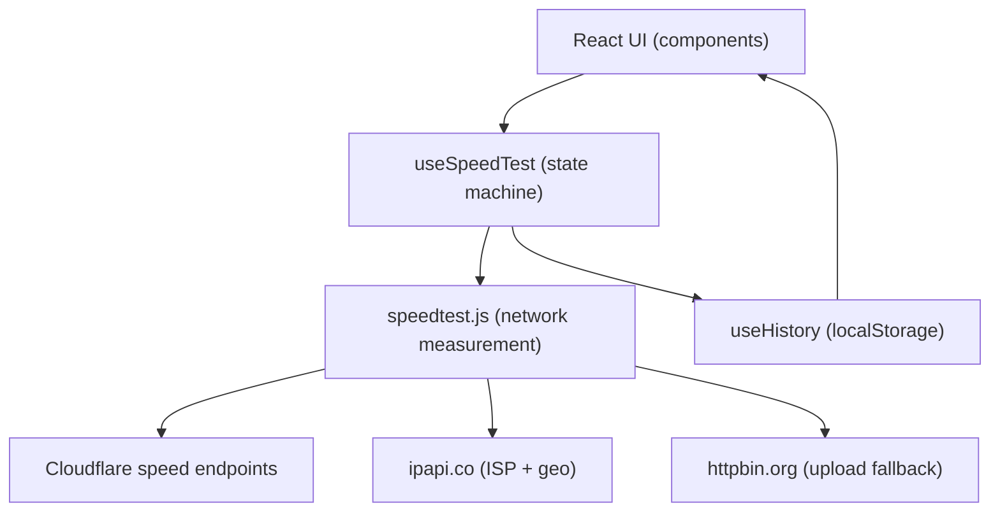

# OrbitSpeed (Internet Speed Test) — Project Report

## Abstract (1 page)
OrbitSpeed is a client-side web application for measuring internet connection quality in real time. It focuses on three user-visible network metrics—download throughput, upload throughput, and latency (ping)—and presents them through an interactive gauge and a concise results dashboard. The application is implemented as a single-page application (SPA) built with React and bundled with Vite, enabling fast local development (HMR) and static deployment to platforms like Vercel.

Unlike server-heavy speed-test services, OrbitSpeed performs measurements directly from the user’s browser using public, CORS-accessible endpoints. Download and ping measurements are taken against Cloudflare’s `speed.cloudflare.com` endpoints, benefiting from a large, globally distributed edge network. Upload uses Cloudflare where possible and falls back to `httpbin.org` to maintain broad compatibility. ISP and approximate location are fetched from `ipapi.co` and cached locally to reduce repeat calls and improve perceived performance. The project includes resilient UI behaviors (error boundary fallback, cancelable tests) and persistent local history using `localStorage`.

Methodologically, OrbitSpeed uses multiple attempts and parallelization to reduce noise: ping uses multiple samples and returns the median; download uses parallel streams and throttled progress updates for a smooth, low-jank gauge. The application is designed as a static build (no custom backend required) and is therefore inherently scalable under high concurrent use on CDNs; the main scaling constraints shift to third-party API rate limits and client device capabilities rather than server CPU/RAM. Security hardening is applied through Content Security Policy (CSP) and other HTTP headers suitable for Vercel deployments.

This report documents the motivation, literature survey, architecture, methodology, results/discussion, test cases, and future scope, with a beginner-friendly operational overview.

## Table of Contents
1. Introduction  
2. Literature Survey  
3. Methodology  
4. Architecture  
5. APIs and Integrations Used  
6. Results and Discussion  
7. Test Cases (Manual + Functional)  
8. Abbreviations  
9. Future Scope  
10. Conclusion  

## 1. Introduction
Internet speed tests help users validate ISP performance, identify local network issues, and choose appropriate settings for streaming, conferencing, and gaming. OrbitSpeed aims to provide:
- A fast, installable, responsive UI for web and mobile.
- Real-time feedback during the measurement process.
- A clear interpretation of results via grades and streaming quality estimations.
- A deployment model that is easy to host and scales well for high traffic.

## 2. Literature Survey
Common approaches in speed-testing tools:
- **Browser-based tests** (client-driven): Use `fetch`/streams/XHR to measure throughput and latency. Advantages: minimal server cost, easy deployment, good for user-centric measurement. Limitations: dependent on browser/network policies and third-party endpoints.
- **Server-assisted tests**: Use dedicated test servers, sometimes with WebSockets/UDP-like behavior for jitter/loss. Advantages: more controlled metrics. Limitations: server costs, global server placement required for fairness.
- **CDN edge tests**: Use large networks (e.g., Cloudflare) for broad geographic coverage; good availability and edge proximity for most users.

OrbitSpeed follows the CDN edge test model, leveraging Cloudflare endpoints for consistent reach and low operational overhead.

## 3. Methodology
### 3.1 Ping (Latency)
- Executes multiple latency samples using a `HEAD` request (fallback to `GET`) to reduce payload overhead.
- Returns the **median** of the samples to reduce the effect of outliers.

### 3.2 Download Throughput
- Performs a warm-up request followed by a main measurement phase.
- Uses **parallel streams** during main measurement to better saturate fast connections.
- Progress updates are throttled (100ms cadence) to avoid UI jank and excessive re-renders.

### 3.3 Upload Throughput
- Generates a random payload using `crypto.getRandomValues()` and uploads via `XMLHttpRequest` to obtain progress callbacks.
- Attempts Cloudflare upload endpoint first, then falls back to `httpbin.org` if needed.

### 3.4 Cancellation / Abort
- The running test can be stopped immediately.
- Network requests are canceled where supported using `AbortController` (and `xhr.abort()` for upload).

### 3.5 Local Persistence (History)
- Stores recent test results in `localStorage`.
- Connection/ISP information is cached for a limited time to reduce repeated third-party API calls.

## 4. Architecture
### 4.1 High-level Component Architecture
- `src/App.jsx`: Page composition (gauge + stats + history + footer).
- `src/hooks/useSpeedTest.js`: Orchestrates phases and manages test state.
- `src/utils/speedtest.js`: Measurement engine (ping/download/upload + ISP info).
- `src/components/*`: UI widgets (gauge, cards, history, score).
- `src/hooks/useHistory.js`: History persistence wrapper.

### 4.2 Data Flow (Mermaid)

### 4.3 State Machine (Phases)
- `IDLE` → `CONNECTING` → `PING` → `DOWNLOAD` → `UPLOAD` → `DONE`
- Any failure transitions to `ERROR`
- User can `STOP`/`RESET` at any time

## 5. APIs and Integrations Used
### 5.1 Cloudflare Speed
- Base: `https://speed.cloudflare.com`
- Download: `GET /__down?bytes=<n>`
- Upload: `POST /__up`

### 5.2 IP / ISP / Geo
- `https://ipapi.co/json/`

### 5.3 Upload Fallback
- `https://httpbin.org/post`

## 6. Results and Discussion
### 6.1 Performance (Build Output)
The build is a static bundle suitable for CDN distribution. Bundle sizes are small enough for fast initial loads on mobile networks and do not require server rendering.

### 6.2 Scalability for 10k–15k concurrent users
Because the app is a static SPA:
- Static hosting (Vercel/CDN) scales well for concurrent traffic.
- Client browsers perform the measurements directly against third-party endpoints.
- Primary risks under high traffic are **third-party API rate limits** (e.g., `ipapi.co`) and device-specific performance constraints on low-end phones/TV browsers.

### 6.3 UX considerations
- Download/upload progress updates are throttled to reduce UI jank.
- Abort/cancel support prevents wasted bandwidth when users stop a test.
- History persistence improves repeat usage without requiring an account.

### 6.4 Screenshots (to be added)
Once screenshots are captured, place them in `docs/screenshots/` and update these references:
- `docs/screenshots/01_idle_desktop.png`
- `docs/screenshots/03_results_desktop.png`
- `docs/screenshots/04_mobile.png`

## 7. Test Cases (Manual + Functional)
1. **Basic happy path**: Start test → completes with ping/download/upload shown.
2. **Stop mid-download**: Start → Stop during download → UI returns to IDLE, no crash.
3. **Stop mid-upload**: Start → Stop during upload → upload request aborts, UI returns to IDLE.
4. **Offline mode**: Disable network → Start test → phase reaches ERROR without infinite spinner.
5. **Third-party blocked**: Block `ipapi.co` → test still measures ping/download/upload, ISP shows Unknown.
6. **History persistence**: Run a test → refresh page → history remains.
7. **Small-screen layout**: 360×640 viewport → stats stack correctly, no horizontal scroll.
8. **Large-screen/TV layout**: ≥1920px width → typography scales and content remains centered.

## 8. Abbreviations
- **SPA**: Single Page Application
- **HMR**: Hot Module Replacement
- **CSP**: Content Security Policy
- **CDN**: Content Delivery Network
- **ISP**: Internet Service Provider
- **XHR**: XMLHttpRequest
- **TLS**: Transport Layer Security

## 9. Future Scope
- Optional authentication (accounts) for cloud-synced history and multi-device profiles.
- Regional server selection and jitter/packet-loss measurements.
- Sharable result cards (PNG export) and result permalinks.
- Accessibility audit (keyboard navigation, reduced motion mode, color contrast modes).

## 10. Conclusion
OrbitSpeed delivers a modern, responsive, and scalable browser-based speed test using React + Vite with Cloudflare-based measurements. Its static deployment model is well-suited for high-concurrency distribution, while reliability and user experience are improved through cancellation support, careful progress throttling, and local persistence. With optional future enhancements (auth, richer metrics, and deeper accessibility), it can evolve into a full connectivity dashboard suitable for production usage at scale.
