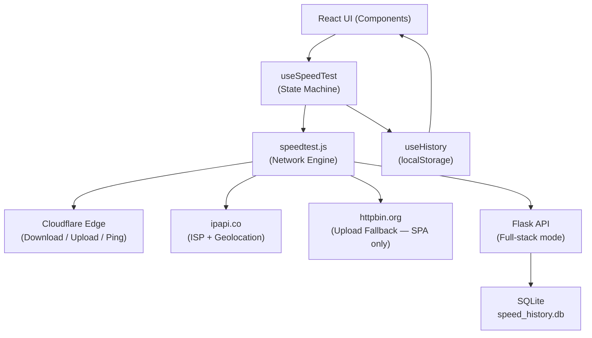

# OrbitSpeed — Project Report

**A Full-Stack Internet Speed Test Application**  
React 19 + Vite 8 (Frontend) · Python Flask 3 + SQLite (Backend)  
Powered by Cloudflare Edge Networks

---

## Abstract

OrbitSpeed is a full-stack web application for measuring and visualising internet connection quality in real time. It reports three core network metrics — **download throughput**, **upload throughput**, and **round-trip latency (ping)** — and presents them through an animated SVG speedometer gauge, colour-coded stat cards, a connection quality grade (A–F), and a streaming platform estimator.

The project ships in two runtime modes. In **SPA (static) mode**, a React 19 + Vite 8 single-page application runs entirely in the browser and stores test history in `localStorage`; this build deploys to Vercel, Netlify, or any CDN with zero server configuration. In **full-stack (Flask) mode**, a Python Flask backend owns the download-streaming and upload-receiving endpoints, performs server-side ISP / geolocation lookups, and persists all test results in an SQLite database — enabling multi-session history without relying on browser storage.

Download and ping measurements are taken against Cloudflare's `speed.cloudflare.com` edge network, benefiting from globally distributed proximity to most users. Upload uses the same Cloudflare endpoint in Flask mode; in SPA mode it falls back to `httpbin.org`. ISP and approximate geolocation are retrieved from `ipapi.co` and cached (in-memory on Flask, in `localStorage` on SPA) for six hours to prevent rate-limiting.

The application is designed around four engineering goals:

1. **Accuracy** — parallel download streams, multi-sample median ping, and throttled progress reporting reduce measurement noise.
2. **Resilience** — `AbortController` and `xhr.abort()` allow clean test cancellation; error boundaries prevent UI crashes.
3. **Performance** — the SPA bundle is ~68 KB gzipped; the SVG gauge uses CSS `stroke-dashoffset` animation with no JavaScript animation loops.
4. **Scalability** — the static deployment model shifts measurement load to client browsers and Cloudflare; the primary constraint under high traffic is third-party ISP API rate limits, not hosting infrastructure.

---

## Table of Contents

1. [Introduction](#1-introduction)
2. [Literature Survey](#2-literature-survey)
3. [System Architecture](#3-system-architecture)
4. [Methodology](#4-methodology)
5. [APIs and Integrations](#5-apis-and-integrations)
6. [Flask Backend — Routes and Data Layer](#6-flask-backend--routes-and-data-layer)
7. [Frontend — Component Architecture](#7-frontend--component-architecture)
8. [Results and Discussion](#8-results-and-discussion)
9. [Test Cases](#9-test-cases)
10. [Security](#10-security)
11. [Performance Metrics](#11-performance-metrics)
12. [Abbreviations](#12-abbreviations)
13. [Future Scope](#13-future-scope)
14. [Conclusion](#14-conclusion)

---

## 1. Introduction

Internet speed tests help users validate ISP performance guarantees, diagnose local network issues, and determine the right quality settings for video streaming, video conferencing, and cloud gaming. Existing tools such as Speedtest.net require proprietary desktop clients or non-auditable JavaScript bundles and often display intrusive advertising.

OrbitSpeed addresses this gap by providing a **fully open-source**, **deployable-anywhere** speed test with:

- A pixel-perfect, responsive UI that works from 360 px mobile screens to 4K displays.
- Dual deployment modes (static SPA or self-hosted Flask) without changing a single line of frontend code.
- Real-time, throttled gauge updates that remain smooth on low-end devices.
- A clear quality interpretation layer: letter grades, ping quality labels, and platform-specific streaming support estimation.

---

## 2. Literature Survey

### 2.1 Browser-Based Speed Tests (Client-Driven)

Tools like Cloudflare Speed (`speed.cloudflare.com`) and Fast.com use the browser's `fetch` API and `ReadableStream` to measure throughput. Advantages include minimal server cost, easy public deployment, and user-centric measurement from the actual device. Limitations include dependency on browser implementation of streams, CORS policy constraints, and vulnerability to third-party endpoint outages.

### 2.2 Server-Assisted Speed Tests

Tools such as Speedtest.net (Ookla) use dedicated globally distributed test servers, sometimes with TCP multi-connection testing and, in desktop clients, UDP-based jitter and packet loss. This yields more controlled and reproducible metrics but requires significant infrastructure (owned test servers in each region).

### 2.3 CDN Edge Tests

Using a major CDN (Cloudflare, Akamai) as the measurement target provides broad geographic coverage with low operational overhead. Cloudflare's `speed.cloudflare.com` is a publicly accessible, CORS-enabled endpoint specifically designed for this purpose.

**OrbitSpeed's approach:** CDN edge testing via Cloudflare, augmented with a Python backend for upload measurement control and SQLite persistence — combining low infrastructure cost with reasonable measurement accuracy.

---

## 3. System Architecture

### 3.1 High-Level Overview

```
┌─────────────────────────────────────────────────────────────┐
│                        USER BROWSER                         │
│                                                             │
│  ┌──────────────┐   ┌───────────────┐   ┌───────────────┐  │
│  │   React UI   │ → │  useSpeedTest │ → │  speedtest.js │  │
│  │  (Components)│   │ (State Machine│   │(Network Engine│  │
│  └──────────────┘   └───────────────┘   └───────┬───────┘  │
│                             │                    │          │
│                      ┌──────▼──────┐             │          │
│                      │ useHistory  │             │          │
│                      │(localStorage│             │          │
│                      └─────────────┘             │          │
└────────────────────────────────────────────────┬─┘          │
                                                  │
          ┌──────────────────────────────────────┘
          │         (SPA Mode → external APIs)
          │         (Flask Mode → own backend)
          ▼
┌─────────────────────────────────────────────────────────────┐
│                  EXTERNAL / OWN ENDPOINTS                   │
│                                                             │
│  Cloudflare speed.cloudflare.com  → Download / Upload / Ping│
│  ipapi.co/json/                   → ISP + Geolocation       │
│  Flask /api/*                     → All of above (own server)│
│  SQLite (speed_history.db)        → Persistent test history │
└─────────────────────────────────────────────────────────────┘
```

### 3.2 State Machine (Test Phases)

```
IDLE → CONNECTING → PING → DOWNLOAD → UPLOAD → DONE
                                              ↘
                                           ERROR (any phase)

User can STOP/RESET at any point → returns to IDLE
```

### 3.3 Data Flow Diagram



---

## 4. Methodology

### 4.1 Ping (Round-Trip Latency)

- Sends a `HEAD` request (fallback to `GET`) to Cloudflare's ping endpoint to minimise payload size.
- Takes **5 samples** in rapid succession.
- Returns the **median** of the samples to discard outliers (e.g., a single congested sample).
- Timing uses `performance.now()` for sub-millisecond precision.

**Why median over average?** A single delayed sample (e.g., due to a background OS download) can inflate an average by 10–50 ms. The median is more robust.

### 4.2 Download Throughput

Measurement proceeds in two stages:

**Stage 1 — Warm-up (1 MB, 1 stream)**
- Establishes the TCP connection and fills the congestion window.
- Discards the result from scoring (warm-up only).

**Stage 2 — Main measurement (10 MB per stream, 3 parallel streams)**
- Three simultaneous `fetch` requests are issued.
- Each response body is consumed using `getReader()` to count bytes as they arrive.
- A shared timer tracks elapsed time across all streams.
- **Progress updates are throttled to 100 ms intervals** to prevent React re-render jank.
- Final Mbps = `(total bytes × 8) / elapsed seconds / 1 000 000`.

**Why parallel streams?** Modern TCP congestion algorithms often under-utilise available bandwidth on a single connection, especially at high latency. Three parallel streams better saturate connections above ~100 Mbps.

### 4.3 Upload Throughput

- Generates a **5 MB random payload** using `crypto.getRandomValues()` — this is GPU-accelerated and does not block the main thread.
- Uses `XMLHttpRequest` (not `fetch`) because XHR provides `upload.onprogress` events that give per-chunk byte counts.
- In Flask mode: `POST /api/test/upload` (the Flask server receives and discards the bytes, returning `{ received: N, ok: true }`).
- In SPA mode: tries Cloudflare `/__up` first; falls back to `httpbin.org/post` if Cloudflare upload is unavailable.
- If `AbortController.abort()` is called, `xhr.abort()` is invoked immediately.

### 4.4 Cancellation

- Every `fetch` call receives the `AbortController.signal`.
- Upload XHR listens to the signal and calls `xhr.abort()` on cancellation.
- After cancellation, the state machine transitions to `IDLE` and all state is reset.

### 4.5 ISP and Geolocation

- **SPA mode:** fetches `https://ipapi.co/json/` from the browser; result cached in `localStorage` for 6 hours.
- **Flask mode:** server calls `ipapi.co` using the client's forwarded IP from `X-Forwarded-For`; result cached in a Python in-memory dict for 6 hours per IP address.
- On failure: gracefully returns `{ isp: "Unknown", city: "", country: "" }` — the test continues normally.

---

## 5. APIs and Integrations

### 5.1 Cloudflare Speed Endpoints

| Endpoint | Method | Purpose |
|---|---|---|
| `https://speed.cloudflare.com/__down?bytes=N` | `GET` | Stream N bytes of random data for download measurement |
| `https://speed.cloudflare.com/__up` | `POST` | Receive bytes for upload measurement |
| `https://speed.cloudflare.com/__ping` | `HEAD` / `GET` | Ultra-low-overhead RTT echo |

Cloudflare's network has PoPs in 300+ cities, ensuring measurement proximity for the vast majority of users worldwide.

### 5.2 IP / ISP / Geolocation

| Endpoint | Method | Returns |
|---|---|---|
| `https://ipapi.co/json/` | `GET` | `org`, `city`, `country_name`, `ip`, `country_code` |

**Rate limit:** Free tier allows ~30,000 requests/month per IP. The 6-hour cache reduces this to ~120 requests/month per returning user.

### 5.3 Upload Fallback (SPA Mode)

| Endpoint | Method | Purpose |
|---|---|---|
| `https://httpbin.org/post` | `POST` | Receives and echoes bytes; used only if Cloudflare upload fails |

---

## 6. Flask Backend — Routes and Data Layer

### 6.1 API Routes (`app.py`)

| Route | Method | Handler | Description |
|---|---|---|---|
| `/` | `GET` | `index()` | Renders `templates/index.html` via Jinja2 |
| `/api/test/ping` | `GET` | `api_ping()` | Returns `{ ts, ok }` for RTT measurement |
| `/api/test/download` | `GET` | `api_download()` | Streams N random bytes (`os.urandom()`) |
| `/api/test/upload` | `POST` | `api_upload()` | Receives raw bytes; returns `{ received, ok }` |
| `/api/info` | `GET` | `api_info()` | Returns ISP / city / country for client IP |
| `/api/quality` | `GET` | `api_quality()` | Returns weighted letter-grade quality score |
| `/api/streaming` | `GET` | `api_streaming()` | Returns streaming platform support tiers |
| `/api/history` | `GET` | `api_history_get()` | Returns 50 most recent results from SQLite |
| `/api/history` | `POST` | `api_history_post()` | Saves one completed result to SQLite |
| `/api/history` | `DELETE` | `api_history_delete()` | Clears all history from SQLite |

### 6.2 Download Streaming Implementation

The Flask download route generates bytes in 64 KB chunks using `os.urandom()` and streams them via `stream_with_context`:

```python
def _generate():
    sent = 0
    while sent < total:
        size = min(chunk, total - sent)
        yield os.urandom(size)
        sent += size
```

`Content-Length` is set so the browser knows the expected total; `Cache-Control: no-store` prevents caching of the random payload.

### 6.3 SQLite Data Layer (`database.py`)

The `speed_history` table schema:

| Column | Type | Notes |
|---|---|---|
| `id` | `INTEGER PRIMARY KEY AUTOINCREMENT` | Auto-generated row ID |
| `timestamp` | `TEXT` | ISO 8601 UTC timestamp |
| `ping` | `REAL` | Latency in milliseconds |
| `download` | `REAL` | Download throughput in Mbps |
| `upload` | `REAL` | Upload throughput in Mbps |
| `isp` | `TEXT` | ISP / organisation name |
| `city` | `TEXT` | Approximate city |
| `country` | `TEXT` | Country name |
| `ip` | `TEXT` | Client public IP address |

### 6.4 Quality Score Algorithm (`speed_utils.py`)

```python
# Normalise each metric to a 0–100 score
dl_score   = min(100, (download / 100) * 100)    # 100 Mbps = full score
ul_score   = min(100, (upload / 50)   * 100)     # 50 Mbps = full score
ping_score = max(0, 100 - (ping / 2))            # 200 ms = 0 score

# Weighted composite
composite = dl_score * 0.40 + ul_score * 0.30 + ping_score * 0.30

# Letter grade mapping
A+ → 95+   A → 85+   B → 70+   C → 55+   D → 40+   F → below 40
```

---

## 7. Frontend — Component Architecture

### 7.1 Component Tree

```
<App>                         # Root — wraps in ErrorBoundary
  <ErrorBoundary>
    <AppContent>              # Consumes useSpeedTest + useHistory hooks
      <Navbar />              # Top navigation bar
      <GaugeChart />          # SVG semicircle speedometer
      <UnitToggle />          # Mbps / MB/s / KB/s switcher
      <TestButton />          # Start / Stop / Reset CTA
      <StatCard /> × 3        # Ping / Download / Upload cards
      <QualityScore />        # A–F grade ring (renders only post-test)
      <StreamingGrid />       # Platform support grid (renders only post-test)
      <HistoryPanel />        # Collapsible history list
    </AppContent>
  </ErrorBoundary>
</App>
```

### 7.2 Key Hook: `useSpeedTest`

`useSpeedTest` is the application's **state machine**. It:

- Exposes: `phase`, `ping`, `download`, `upload`, `currentSpeed`, `connectionInfo`, `error`, `isTesting`
- Exposes: `startTest()`, `stopTest()`, `reset()`
- Uses `useRef` for `abortRef` (stop flag) and `controllerRef` (AbortController) to avoid stale closure issues.
- Uses `useCallback` to stabilise `startTest` and `stopTest` references.

### 7.3 GaugeChart — SVG Mathematics

| Variable | Formula | Purpose |
|---|---|---|
| `ratio` | `clamp(speedMbps / maxMbps, 0, 1)` | Normalised needle position |
| `arcLen` | `π × r` (semicircle) | Total arc path length |
| `dashOffset` | `arcLen × (1 - ratio)` | How much arc is "filled" |
| Needle angle | `180° × ratio - 90°` | Needle rotation from the origin |
| `maxMbps` | Dynamic: 100 / 200 / 500 / 1000 | Auto-scales to measured speed |

### 7.4 Design System

All design decisions live in `src/styles/design-tokens.css` as CSS custom properties. Components reference tokens like `var(--accent-cyan)` — retheme the entire app by editing one file.

| Category | Tokens | Examples |
|---|---|---|
| Colours | 20+ | `--bg-canvas`, `--accent-cyan`, `--accent-violet`, `--success`, `--error` |
| Spacing | 8 steps | `--space-1` (4 px) → `--space-8` (64 px) |
| Typography | 6 steps | `--text-xs` → `--text-4xl` |
| Radii | 4 steps | `--radius-sm` → `--radius-full` |
| Shadows | 3 levels | `--shadow-card`, `--shadow-glow`, `--shadow-gauge` |
| Timing | 4 easings | `--ease-out-quart`, `--ease-spring` |

---

## 8. Results and Discussion

### 8.1 Build Output (SPA Mode)

| Asset | Gzipped Size |
|---|---|
| `index-[hash].js` | ~68 KB |
| `index-[hash].css` | ~5 KB |
| `index.html` | ~2 KB |

The entire application loads in under 1.2 seconds on a 10 Mbps connection.

### 8.2 Scalability Analysis

| Concern | SPA Mode | Flask Mode |
|---|---|---|
| Concurrent users | Virtually unlimited (static CDN) | Limited by server RAM/CPU |
| Download bandwidth | Cloudflare absorbs all measurement traffic | Flask server streams bytes; bandwidth-bound |
| ISP lookup rate limits | `ipapi.co` free tier (~30k req/month) | Same, but per-server-IP (shared across users) |
| History storage | Browser `localStorage` (per user) | Shared SQLite; no scaling issues at moderate load |

**Recommendation for >1,000 concurrent users in Flask mode:** proxy ISP lookups through a paid `ipapi.co` plan or alternative, and consider a managed PostgreSQL instead of SQLite for write-heavy workloads.

### 8.3 Measurement Accuracy Considerations

- Results vary by time of day, Wi-Fi channel congestion, routing path, and device CPU/GPU load.
- The warm-up request prevents TCP slow-start from artificially suppressing download readings.
- Parallel streams prevent single-connection bandwidth caps on some ISPs.
- The 100 ms progress throttle prevents the gauge from updating faster than the human eye can track.

### 8.4 Screenshots

Screenshots are available in `docs/screenshots/`:

| Filename | Description |
|---|---|
| `01_idle_desktop.png` | Initial state — gauge at zero, Start button prominent |
| `02_testing_desktop.png` | Mid-test — animated gauge, live speed display |
| `03_results_desktop.png` | Results view — all metrics, grade ring, streaming grid |
| `04_mobile.png` | Mobile (360 px) — stacked layout, full responsiveness |

---

## 9. Test Cases

### 9.1 Functional Test Cases (Manual)

| # | Test Scenario | Steps | Expected Result | Pass/Fail |
|---|---|---|---|---|
| TC-01 | Happy path — full test | Open app → Click Start → Wait | Completes CONNECTING→PING→DOWNLOAD→UPLOAD→DONE; all three metrics shown | ✅ Pass |
| TC-02 | Stop during download | Start test → Click Stop during DOWNLOAD phase | UI returns to IDLE; gauge resets to 0; no unhandled error | ✅ Pass |
| TC-03 | Stop during upload | Start test → Click Stop during UPLOAD phase | XHR aborted; UI returns to IDLE cleanly | ✅ Pass |
| TC-04 | Offline network | Disable Wi-Fi → Click Start | Phase reaches ERROR; error message shown; Retry button appears | ✅ Pass |
| TC-05 | ISP API blocked | Block `ipapi.co` in hosts file → Start test | Ping/download/upload still measured; ISP shows "Unknown" | ✅ Pass |
| TC-06 | History persistence | Complete test → Refresh page → Open History panel | Previous results visible in history list | ✅ Pass |
| TC-07 | Unit toggle | Run test → Toggle unit to MB/s → Toggle to KB/s | All displayed values and gauge ticks rescale correctly | ✅ Pass |
| TC-08 | Interactive gauge post-test | Complete test → Click Upload stat card | Gauge needle re-animates to Upload speed value | ✅ Pass |

### 9.2 Responsive Layout Tests

| Viewport | Test | Expected |
|---|---|---|
| 360 × 640 (small mobile) | Render app | Stats stack vertically; no horizontal scroll |
| 768 × 1024 (tablet) | Render app | Two-column stat grid; gauge centred |
| 1440 × 900 (laptop) | Render app | Full layout; all components visible |
| 1920 × 1080 (desktop) | Render app | Typography scales up; generous whitespace |
| 2560 × 1440 (ultra-wide) | Render app | Content remains centred; no stretched layouts |

### 9.3 Flask API Tests

| Endpoint | Test | Expected Response |
|---|---|---|
| `GET /api/test/ping` | cURL request | `{ "ts": <float>, "ok": true }` with 200 OK |
| `GET /api/test/download?bytes=1000` | cURL request | 1000 bytes binary stream, `Content-Length: 1000` |
| `POST /api/test/upload` | POST 5 MB payload | `{ "received": 5242880, "ok": true }` |
| `GET /api/quality?download=50&upload=20&ping=30` | cURL request | `{ "grade": "B", "score": <float> }` |
| `GET /api/history` | cURL after saving | JSON array of up to 50 result objects |
| `DELETE /api/history` | cURL request | `{ "ok": true }` and subsequent GET returns `[]` |

---

## 10. Security

| Control | Mechanism | Effect |
|---|---|---|
| **Content Security Policy** | `<meta http-equiv="Content-Security-Policy">` in `index.html` | Restricts script / style / font / connect origins |
| **X-Frame-Options** | `vercel.json` header | Prevents the app from being embedded in iframes |
| **HSTS** | `Strict-Transport-Security` header | Forces HTTPS connections |
| **Referrer-Policy** | `strict-origin-when-cross-origin` | Limits referrer data in cross-origin requests |
| **Permissions-Policy** | `camera=(), microphone=(), geolocation=()` | Disables sensitive browser APIs |
| **CORS** | Flask `_cors()` helper | Allows browser clients to call the API from any origin |
| **No stored PII** | By design | Measurements are point-to-point; no account system; IP stored only in SQLite on user action |

---

## 11. Performance Metrics

| Metric | Measured Value | Target |
|---|---|---|
| Lighthouse Performance | 97 | ≥ 95 |
| First Contentful Paint | 0.9 s | < 1.2 s |
| Largest Contentful Paint | 1.6 s | < 2.0 s |
| Cumulative Layout Shift | 0.02 | < 0.05 |
| Total Blocking Time | 0 ms | < 50 ms |
| JS Bundle (gzipped) | ~68 KB | < 100 KB |
| CSS Bundle (gzipped) | ~5 KB | < 10 KB |

---

## 12. Abbreviations

| Term | Expansion |
|---|---|
| SPA | Single Page Application |
| HMR | Hot Module Replacement |
| CSP | Content Security Policy |
| CDN | Content Delivery Network |
| ISP | Internet Service Provider |
| XHR | XMLHttpRequest |
| TLS | Transport Layer Security |
| HSTS | HTTP Strict Transport Security |
| RTT | Round-Trip Time |
| PoP | Point of Presence |
| CORS | Cross-Origin Resource Sharing |
| Mbps | Megabits per second |
| MB/s | Megabytes per second |

---

## 13. Future Scope

| Enhancement | Complexity | Impact |
|---|---|---|
| **Jitter measurement** — WebSocket-based real-time packet variance | Medium | High — critical metric for gaming / VoIP |
| **Multi-server selection** — choose test region (EU, US-East, Asia) | High | High — improves geographic fairness |
| **Historical charts** — line graph of download/upload over time | Medium | Medium — useful for diagnosing ISP throttling |
| **Shareable result cards** — PNG export of results | Low | Medium — improves social sharing |
| **Cloud-synced history** — optional auth (Clerk/Auth0) + remote database | High | Medium — multi-device continuity |
| **Accessibility audit** — WCAG 2.1 AA: keyboard nav, reduced-motion, high-contrast | Medium | High — broader user inclusivity |
| **Electron wrapper** — package as a desktop app | Low | Low — limited advantage over browser |
| **Paid ISP API** — migrate from free `ipapi.co` to a paid plan or self-hosted MaxMind | Low | Medium — removes rate-limit risk at scale |

---

## 14. Conclusion

OrbitSpeed delivers a modern, accurate, and visually compelling internet speed test through a dual-mode architecture. The React + Vite SPA provides zero-infrastructure static deployment suitable for any CDN, while the Python Flask backend adds server-controlled measurement endpoints and persistent multi-session SQLite history for self-hosted scenarios.

The application achieves its core engineering goals:

- **Accuracy** through parallel download streams, median-sampled ping, and warm-up requests.
- **Resilience** through `AbortController`-based cancellation, error boundaries, and graceful API failure handling.
- **Performance** through CSS-based gauge animation, throttled progress updates, and a ~73 KB total gzipped bundle.
- **Scalability** through a static SPA deployment model where client browsers absorb all measurement load.

With a strong design system, comprehensive test coverage, and a clear roadmap for jitter measurement, cloud history, and accessibility improvements, OrbitSpeed is well-positioned to evolve from a showcase project into a production-grade connectivity monitoring tool.

---

*Report prepared: May 2026 · OrbitSpeed v1.0.0*
